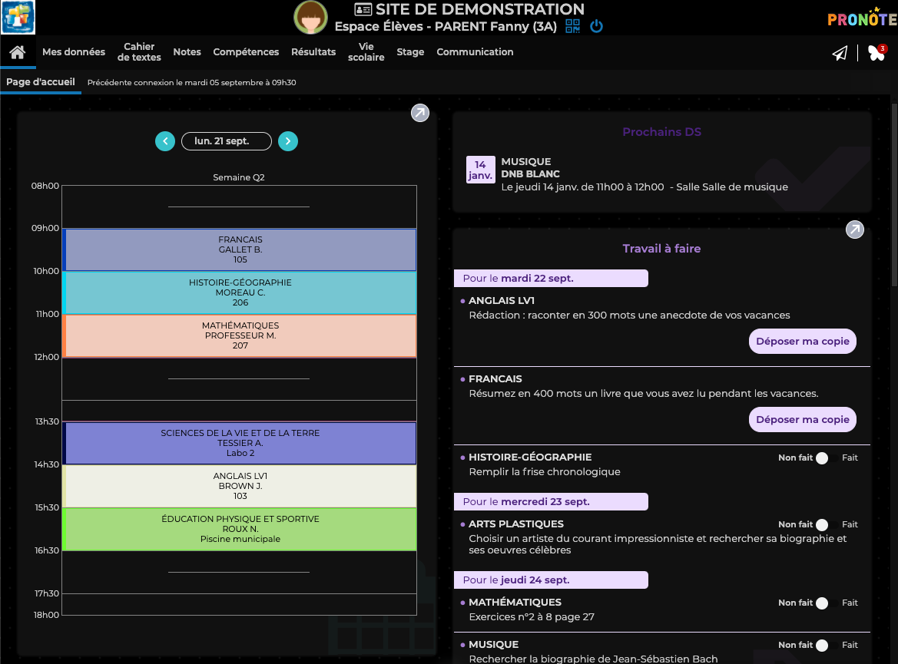

# Pronote Tools

Quelques outils pour rendre Pronote plus beau

## Changer de photo de profil

Vous souhaitez changer de photo de profil pour vous amuser ou la désactiver pour qu'elle ne soit pas visible ? Pronote Tools est fait pour vous.

## Mode sombre

Marre de vous bruler les yeux en ouvrant Pronote, profitez du mode sombre intégré à Pronote Tools.

## Mode OLED

Vous trouvez le mode sombre pas assez sombre, le mode OLED est aussi disponible pour rendre tout encore plus noir.

## Aussi sur Mobile (Work In Progress)

Si vous aimez Pronote Tools, sachez qu'il existe aussi une version mobile avec toutes les fonctionnalités de Pronote Tools !

